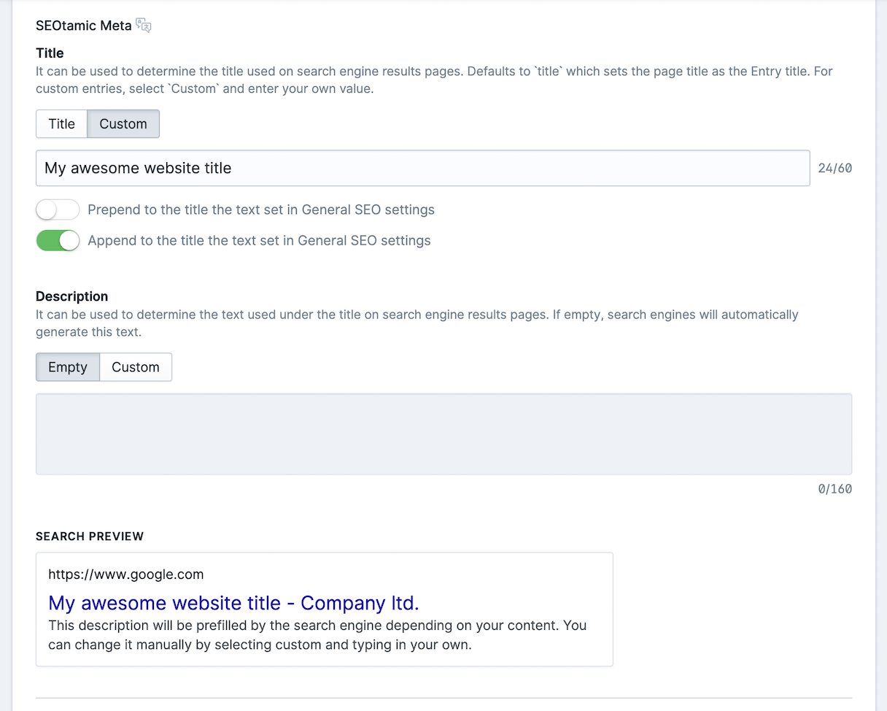
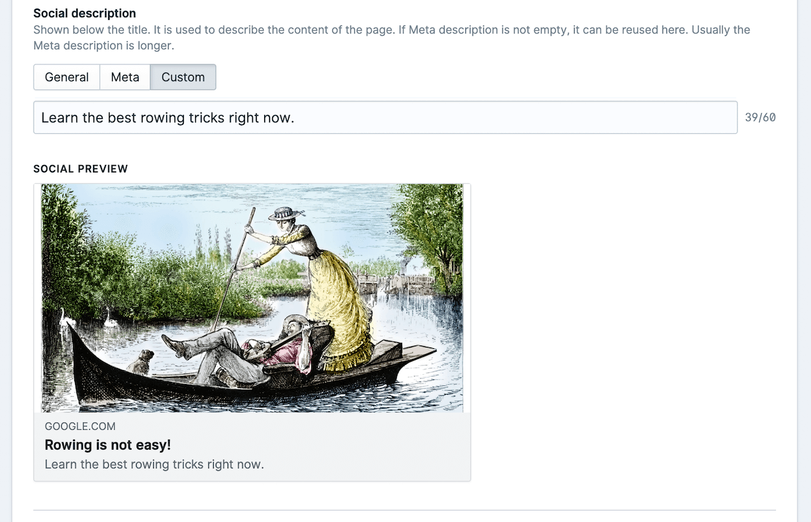

# Seotamic - Statamic SEO Addon

Statamic v3 only. Automatically adds a SEO tab to all your collection entries where you can fine tune SEO for every entry. Works perfectly with Antlers, Blade and in headless mode with the Statamic REST API or GraphQL integration out of the box.

## Quick Antlers usage sample

```php
{{ seotamic }}
```

Generates the whole array of SEO settings:

```html
<title>My Page Title</title>
<meta name="description" content="SEO friendly description" />
<link rel="canonical" href="https://mysite.com/page" />
<meta property="og:url" content="https://mysite.com/page" />
<meta property="og:site_name" content="Site name" />
<meta property="og:title" content="My Page Title" />
<meta property="og:description" content="SEO friendly description" />
<meta property="og:locale" content="en_US" />
<meta property="og:image" content="https://mysite.com/img/og.jpg" />
...
```

# Version 3 changes

Version 3 has breaking changes. If you update from version 1 or 2, your global settings will not be transfered. The data layout is a bit different and so is the data on specific entries.

A migration script is planned, but not yet available.

# Installation

Include the package with composer:

```sh
composer require cnj/seotamic
```

The package requires Laravel 9+ and PHP 8.0+. It will auto register.

The SEO section tab will appear on all collection entries automatically.

## Configuration (optional)

You can override the default options by publishing the configuration:

```
php artisan vendor:publish --provider="Cnj\Seotamic\ServiceProvider" --tag=config
```

This will copy the default config file to `config/seotamic.php'.

If you need to change the default assets container, make sure to apply the change in the Blueprints as well.

# Usage

Usage is fairly simple and straight forward. You can visit the global Settings by following the Seotamic link on the navigation in the CP. Make sure to follow the instructions on each field.



After this you can fine tune the output of each collection entry by editing the SEO settings under the entry's SEO tab. In version 3 you can also preview the output of the meta and social settings. The previews should give an accurate representation of the output.



## Antlers

There are several antler tags available, the easiest is to just include the do everything base tag in the head of your layout:

```
{{ seotamic }}
```

If you need more control you can manually get each part of the output by using:

```
{{ seotamic:title }}
{{ seotamic:description }}
{{ seotamic:canonical }}
```

This will return strings, so you need to wrap them in the appropriate tags, ie:

```html
<title>{{ seotamic:title }}</title>
```

Social ones will still return everything with tags

```
{{ seotamic:og }}
{{ seotamic:twitter }}
```

## Blade

Similarly to the Antlers usage, you can use the same tags using Blade:

```php
{!! Statamic::tag('seotamic')->context(get_defined_vars()) !!}
```

It works similary to the Antlers tags, so you can use single values as well.

## Headless

Headless use is straightforward. If using the REST API or GraphQL, the entry will include three Seotamic fields: `seotamic_meta`, `seotamic_social` and `seotamic_canonical` with the prefilled SEO data.

## Dynamic OG Image injection

In projects where you want the OG Image to be dynamic, for
now you can use this ViewModel and inject it to your collection in order to
dynamically assign the OG Image.

```php
<?php

namespace App\ViewModels;

use Statamic\View\ViewModel;

class OgImage extends ViewModel
{
    public function data(): array
    {
        $social = $this->cascade->get('seotamic_social'); if ($social) { return
[ ...$social, 'image' => 'https://myimageurl.com/image.jpg', ]; } return []; } }
```

In the example above we use a hardcoded image url which you can change to suit your usecase. Then in your collections you just have to inject the ViewModel.

```yaml
title: Posts
inject:
  view_model: App\ViewModels\OgImage
```

# Credits

This package was built by [CNJ Digital](https://www.cnj.si/).

# Version 3 License

Version 3 is a commercial addon for Statamic. It is open source but not free to use. You can purchase a license at [Statamic Marketplace](https://statamic.com/marketplace/addons/seotamic).

# Version 2 and 1 License

Version 2 and 1 were licensed under the MIT License.
